# 项目组件关系文档

> 本文档记录了项目中所有Vue组件的调用关系和层级结构
> 最后更新时间: 2026-03-30

---

## 目录

1. [组件层级总览](#组件层级总览)
2. [页面组件 (Views)](#页面组件-views)
3. [业务组件 (Components)](#业务组件-components)
4. [组件依赖关系图](#组件依赖关系图)
5. [更新规范](#更新规范)

---

## 组件层级总览

```
App.vue (根组件)
├── 顶部标签栏 (Tab Bar)
└── <router-view />
    ├── Admin.vue (游戏管理后台)
    ├── GameDirectory.vue (游戏目录详情)
    ├── Workbench.vue (规则配置工作台)
    ├── RoomCreatorPage.vue (创房面板配置-容器)
    │   ├── ItemManagerPage.vue (面板选项管理)
    │   └── SimpleDependencyPage.vue (选项联动列表-嵌入)
    └── SimpleDependencyPage.vue (选项联动简版-独立页面)
```

---

## 页面组件 (Views)

### 1. Admin.vue - 游戏管理后台

**功能**: 游戏列表展示、新增游戏、环境切换(test/online)

**导入的子组件**:
| 组件名 | 路径 | 用途 |
|--------|------|------|
| GameInfo.vue | `../components/GameInfo.vue` | 游戏属性编辑弹窗 |

**API依赖**:
- `gameApi.js` - 游戏数据操作

---

### 2. GameDirectory.vue - 游戏目录详情

**功能**: 展示游戏基本信息、文件列表(草稿/测试/正式)

**导入的子组件**:
| 组件名 | 路径 | 用途 |
|--------|------|------|
| FileCard.vue | `../components/FileCard.vue` | 文件卡片展示 |
| CopyToModal.vue | `../components/CopyToModal.vue` | 复制到弹窗 |
| SubmitTestModal.vue | `../components/SubmitTestModal.vue` | 提测弹窗 |
| SubmitHistoryModal.vue | `../components/SubmitHistoryModal.vue` | 提测记录弹窗 |

**API依赖**:
- `gameApi.js` - 游戏文件操作

---

### 3. Workbench.vue - 规则配置工作台

**功能**: 三栏式布局(组件列表/画布/属性面板)、规则配置

**导入的子组件**:
| 组件名 | 路径 | 用途 |
|--------|------|------|
| WhetherToEstablish.vue | `../components/variable-editing/WhetherToEstablish.vue` | 变量管理弹窗 |
| CalcScoreConfig.vue | `../components/CalcScoreConfig.vue` | 算分规则配置弹窗 |
| SubmitTestModal.vue | `../components/SubmitTestModal.vue` | 提测弹窗 |

**第三方库**:
- `vue-draggable-resizable` - 可拖拽面板

---

### 4. RoomCreatorPage.vue - 创房面板配置（容器页面）

**功能**: 创房面板选项配置容器，通过内部Tab切换显示 ItemManagerPage 和 SimpleDependencyPage

**导入的子组件**:
| 组件名 | 路径 | 用途 |
|--------|------|------|
| ItemManagerPage.vue | `./ItemManagerPage.vue` | 面板选项管理（基础参数+分组管理） |
| SimpleDependencyPage.vue | `./SimpleDependencyPage.vue` | 选项联动列表（嵌入模式） |
| BasicParamsDrawer.vue | `../components/BasicParamsDrawer.vue` | 基础参数抽屉 |
| Drawer.vue | `../components/Drawer.vue` | 选项配置抽屉 |
| AddGroupModal.vue | `../components/AddGroupModal.vue` | 添加分组弹窗 |
| EditorDialogContainer.vue | `../components/editors/EditorDialogContainer.vue` | 编辑器弹窗容器 |

---

### 5. ItemManagerPage.vue - 面板选项管理

**功能**: 整合 BasicParams 和 GroupManager，负责面板选项的展示和交互

**导入的子组件**:
| 组件名 | 路径 | 用途 |
|--------|------|------|
| BasicParams.vue | `../components/BasicParams.vue` | 基础参数配置 |
| GroupManager.vue | `../components/GroupManager.vue` | 分组管理 |

**使用方式**:
- 被 RoomCreatorPage.vue 以组件形式引用
- 通过 props 接收 basicConfig 和 groups 数据
- 通过 emit 事件通知父组件更新数据

---

### 6. SimpleDependencyPage.vue - 选项联动简版

**功能**: 简版选项联动规则列表、增删改查

**导入的子组件**:
| 组件名 | 路径 | 用途 |
|--------|------|------|
| RuleEditorModalPro.vue | `../components/RuleEditorModalPro.vue` | 规则编辑器弹窗 |

**使用方式**:
- 独立页面: `/simple-dependency/:id`
- 嵌入模式: 被 RoomCreatorPage.vue 通过 Tab 切换引用

---

## 业务组件 (Components)

### 核心组件

#### Sidebar.vue - 侧边栏
**被引用**: RoomCreator.vue
**功能**: 添加分组、打开选项联动编辑器

#### RoomCreator.vue - 创房面板
**被引用**: (已整合到 RoomCreatorPage.vue)
**导入组件**: Sidebar, BasicParams, GroupManager, Drawer, DependencyEditor
**注意**: 使用 Element Plus 的 el-icon 替代了原来的 Icon.vue 组件

#### GameInfo.vue - 游戏信息编辑
**被引用**: Admin.vue
**导入组件**: Transfer.vue
**功能**: 游戏属性编辑、APK选择

#### FileCard.vue - 文件卡片
**被引用**: GameDirectory.vue
**功能**: 展示文件信息、操作按钮(查看/复制/发布)

---

### 分组与组件管理

#### GroupManager.vue - 分组管理
**被引用**: RoomCreatorPage.vue, RoomCreator.vue
**功能**: 分组展示、添加组件、编辑分组

#### BasicParams.vue - 基础参数
**被引用**: RoomCreatorPage.vue, RoomCreator.vue
**功能**: 人数/局数/底分配置

#### AddGroupModal.vue - 添加分组弹窗
**被引用**: RoomCreatorPage.vue
**功能**: 创建/编辑分组

---

### 抽屉组件

#### Drawer.vue - 选项配置抽屉
**被引用**: RoomCreatorPage.vue, RoomCreator.vue
**功能**: 组件选项配置、组件选择器

#### BasicParamsDrawer.vue - 基础参数抽屉
**被引用**: RoomCreatorPage.vue
**功能**: 人数/局数/底分模板选择

---

### 弹窗组件

#### CopyToModal.vue - 复制到弹窗
**被引用**: GameDirectory.vue
**功能**: 复制文件到其他游戏

#### SubmitTestModal.vue - 提测弹窗
**被引用**: GameDirectory.vue, Workbench.vue
**功能**: 提交测试、选择目标环境

#### SubmitHistoryModal.vue - 提测记录弹窗
**被引用**: GameDirectory.vue
**功能**: 展示提测历史记录

#### WhetherToEstablish.vue - 变量编辑弹窗
**被引用**: Workbench.vue
**导入组件**: AddMultiplyMaxMin.vue, Establish.vue
**功能**: 变量列表管理，支持多种变量类型编辑

#### AddMultiplyMaxMin.vue - 组内计算编辑器
**被引用**: WhetherToEstablish.vue
**功能**: 组内相加/相乘/取最大/取最小类型变量编辑

#### Establish.vue - 条件表达式编辑器
**被引用**: WhetherToEstablish.vue
**功能**: 判断是否成立/依次判断/累加/累乘类型变量编辑

#### CalcScoreConfig.vue - 算分规则配置
**被引用**: Workbench.vue
**导入组件**: ScoreModifierModal.vue
**功能**: 算分规则编辑

#### RuleEditorModalPro.vue - 规则编辑器Pro
**被引用**: SimpleDependencyPage.vue
**导入组件**: ConditionTree.vue, ActionConfig.vue
**功能**: 选项联动规则编辑（替代旧版 RuleEditorModal）

#### ScoreModifierModal.vue - 分数修正弹窗
**被引用**: CalcScoreConfig.vue
**功能**: 分数修正配置

#### ActionLimitEditor.vue - 动作限制编辑器
**路径**: `src/components/editors/ActionLimitEditor.vue`
**被引用**: (根据 JSON 配置动态调用，button editorType=actionlimit 时使用)
**功能**: 动作限制规则列表编辑，支持添加、删除、复制规则项
**特点**: 基于 ContractEditor.vue 简化实现，去除了复杂的 ConfigFormulaPure 依赖

#### ExpressionInput.vue - 表达式输入组件
**路径**: `src/components/editors/ExpressionInput.vue`
**被引用**: ActionLimitEditor.vue
**导入组件**: IdentitySelector.vue
**功能**: 可视化表达式编辑器，支持嵌套标签块渲染
**特点**:
- 数值型单元：[身份] 的 [状态]
- 布尔型单元：[身份] 的状态 [为/不为] [状态]
- 支持身份切换、否定状态切换
- Dropdown 形式展开编辑器

#### IdentitySelector.vue - 身份选择器
**路径**: `src/components/editors/IdentitySelector.vue`
**被引用**: ExpressionInput.vue
**功能**: 游戏元素身份选择下拉组件
**特点**: 支持泛身份特殊标识（所有闲家、所有玩家等）

---

### 功能组件

#### Transfer.vue - 穿梭框
**被引用**: GameInfo.vue
**功能**: APK选择、左右穿梭

#### ConditionTree.vue - 条件树
**被引用**: DependencyEditor.vue, RuleEditorModalPro.vue
**功能**: 条件规则树形展示（递归自引用）

#### ComponentSelector.vue - 组件选择器
**被引用**: Drawer.vue
**功能**: 组件列表选择

#### DependencyEditor.vue - 依赖编辑器
**被引用**: RoomCreatorPage.vue, RoomCreator.vue
**导入组件**: ConditionTree.vue, ActionConfig.vue
**功能**: 高级选项联动编辑

#### ActionConfig.vue - 动作配置
**被引用**: DependencyEditor.vue, RuleEditorModalPro.vue
**功能**: 联动动作配置

---

### 数据录入组件

#### VariableEditor.vue - 变量编辑器
**被引用**: VariableManagementModal.vue
**导入组件**: CustomSelect.vue
**功能**: 单个变量编辑

#### CustomSelect.vue - 自定义下拉
**被引用**: VariableEditor.vue
**功能**: 增强下拉选择

---

## 组件依赖关系图

```mermaid
graph TD
    %% 页面层级
    App[App.vue] --> Router[<router-view />]
    Router --> Admin[Admin.vue]
    Router --> GameDir[GameDirectory.vue]
    Router --> Workbench[Workbench.vue]
    Router --> RoomCreator[RoomCreatorPage.vue]
    Router --> SimpleDep[SimpleDependencyPage.vue]

    %% Admin 依赖
    Admin --> GameInfo[GameInfo.vue]
    GameInfo --> Transfer[Transfer.vue]

    %% GameDirectory 依赖
    GameDir --> FileCard[FileCard.vue]
    GameDir --> CopyToModal[CopyToModal.vue]
    GameDir --> SubmitTestModal[SubmitTestModal.vue]
    GameDir --> SubmitHistoryModal[SubmitHistoryModal.vue]

    %% Workbench 依赖
    Workbench --> VariableMgmt[WhetherToEstablish.vue]
    Workbench --> CalcScore[CalcScoreConfig.vue]
    VariableMgmt --> AddMultiplyMaxMin[AddMultiplyMaxMin.vue]
    VariableMgmt --> Establish[Establish.vue]
    CalcScore --> ScoreModifier[ScoreModifierModal.vue]

    %% RoomCreatorPage 依赖
    RoomCreator --> ItemMgr[ItemManagerPage.vue]
    RoomCreator --> SimpleDepEmbed[SimpleDependencyPage.vue]
    RoomCreator --> BasicParamsDrawer[BasicParamsDrawer.vue]
    RoomCreator --> Drawer[Drawer.vue]
    RoomCreator --> AddGroupModal[AddGroupModal.vue]
    RoomCreator --> EditorDialogContainer[EditorDialogContainer.vue]

    %% ItemManagerPage 依赖
    ItemMgr --> BasicParams[BasicParams.vue]
    ItemMgr --> GroupManager[GroupManager.vue]

    %% Drawer 依赖
    Drawer --> ComponentSelector[ComponentSelector.vue]

    %% SimpleDependencyPage 依赖
    SimpleDep --> RuleEditorPro[RuleEditorModalPro.vue]
    SimpleDepEmbed --> RuleEditorPro

    %% RuleEditorModalPro 依赖
    RuleEditorPro --> ConditionTree[ConditionTree.vue]
    RuleEditorPro --> ActionConfig[ActionConfig.vue]

    %% ExpressionInput 依赖
    ExpressionInput --> IdentitySelector[IdentitySelector.vue]

    %% 样式说明
    style App fill:#3b82f6,color:#fff
    style Router fill:#60a5fa,color:#fff
    style Admin fill:#10b981,color:#fff
    style GameDir fill:#10b981,color:#fff
    style Workbench fill:#10b981,color:#fff
    style RoomCreator fill:#10b981,color:#fff
    style ItemMgr fill:#10b981,color:#fff
    style SimpleDep fill:#10b981,color:#fff
    style SimpleDepEmbed fill:#10b981,color:#fff
```



---

## 更新规范

### 新增组件时

1. **在本文档中添加组件信息**:
   - 组件名称和路径
   - 功能描述
   - 父组件引用关系
   - 子组件依赖关系

2. **更新依赖关系图**:
   - 在 Mermaid 图中添加新的节点和连线
   - 保持图表的层级结构清晰

3. **更新目录结构**:
   - 确保组件分类正确(页面组件/业务组件)

### 修改组件时

1. **检查依赖关系**:
   - 确认是否影响其他组件
   - 更新引用关系表

2. **更新文档**:
   - 修改功能描述
   - 更新导入的子组件列表

### 删除组件时

1. **检查引用**:
   - 确认无其他组件引用该组件
   - 移除文档中相关记录

2. **更新关系图**:
   - 移除 Mermaid 图中对应节点

---

## 文件路径速查

```
src/
├── views/                          # 页面组件
│   ├── Admin.vue                   # 游戏管理后台
│   ├── GameDirectory.vue           # 游戏目录详情
│   ├── Workbench.vue               # 规则配置工作台
│   ├── RoomCreatorPage.vue         # 创房面板配置（容器页面）
│   ├── ItemManagerPage.vue         # 面板选项管理
│   └── SimpleDependencyPage.vue    # 选项联动简版
│
├── components/                     # 业务组件
│   ├── Sidebar.vue                 # 侧边栏
│   ├── RoomCreator.vue             # 创房面板(旧)
│   ├── GameInfo.vue                # 游戏信息编辑
│   ├── FileCard.vue                # 文件卡片
│   ├── GroupManager.vue            # 分组管理
│   ├── BasicParams.vue             # 基础参数
│   ├── Drawer.vue                  # 选项配置抽屉
│   ├── BasicParamsDrawer.vue       # 基础参数抽屉
│   ├── Transfer.vue                # 穿梭框
│   ├── ConditionTree.vue           # 条件树
│   ├── ComponentSelector.vue       # 组件选择器
│   ├── DependencyEditor.vue        # 依赖编辑器
│   ├── ActionConfig.vue            # 动作配置
│   ├── AddGroupModal.vue           # 添加分组弹窗
│   ├── CopyToModal.vue             # 复制到弹窗
│   ├── SubmitTestModal.vue         # 提测弹窗
│   ├── SubmitHistoryModal.vue      # 提测记录弹窗
│   ├── variable-editing/           # 变量编辑组件目录
│   │   ├── WhetherToEstablish.vue  # 变量编辑弹窗
│   │   └── common/                 # 子组件目录
│   │       ├── AddMultiplyMaxMin.vue # 组内计算编辑器
│   │       ├── Establish.vue       # 条件表达式编辑器
│   │       ├── util.ts             # 数据转换工具
│   │       └── Index.ts            # 组件导出索引
│   ├── CalcScoreConfig.vue         # 算分规则配置
│   ├── RuleEditorModalPro.vue      # 规则编辑器Pro
│   ├── ScoreModifierModal.vue      # 分数修正弹窗
│   ├── CustomSelect.vue            # 自定义下拉
│   └── editors/                    # 编辑器组件目录
│       ├── ActionLimitEditor.vue   # 动作限制编辑器
│       ├── ExpressionInput.vue     # 表达式输入组件
│       ├── IdentitySelector.vue    # 身份选择器
│       ├── MotionConstraintEditor.vue # 动作约束编辑器
│       ├── ScoreCorrectionEditor.vue  # 分数修正编辑器
│       ├── ScoreCalculationFormulaEditing.vue # 算分公式编辑
│       ├── MahjongStackDialog.vue   # 麻将牌堆编辑器
│       ├── FanXingDialog.vue        # 番型编辑器
│       └── EditorDialogContainer.vue # 编辑器弹窗容器
│
├── api/                            # API接口
│   ├── gameApi.js                  # 游戏相关API
│   └── apkApi.js                   # APK相关API
│
└── router/
    └── index.js                    # 路由配置
```

---

## 已清理文件记录

以下文件已被清理（未使用或已废弃）：

| 文件名 | 清理原因 | 清理时间 |
|--------|----------|----------|
| Icon.vue | 文件缺失，使用 Element Plus el-icon 替代 | 2026-03-13 |
| AdvancedConfig.vue | 未被任何组件引用 | 2026-03-13 |
| ComponentPreview.vue | 未被任何组件引用 | 2026-03-13 |
| PlayerCountConfig.vue | 未被任何组件引用 | 2026-03-13 |
| RoundCountConfig.vue | 未被任何组件引用 | 2026-03-13 |
| RuleEditorModal.vue | 被 RuleEditorModalPro 替代 | 2026-03-13 |
| ComponentSelectorDrawer.vue | 未被任何组件引用 | 2026-03-13 |
| VariableManagementModal.vue | 被 WhetherToEstablish 替代 | 2026-03-20 |
| VariableEditor.vue | 被 WhetherToEstablish 替代 | 2026-03-20 |
| CustomSelect.vue | 被 WhetherToEstablish 替代 | 2026-03-20 |

---

*本文档由系统自动生成，创建新组件时请务必更新此文档*
